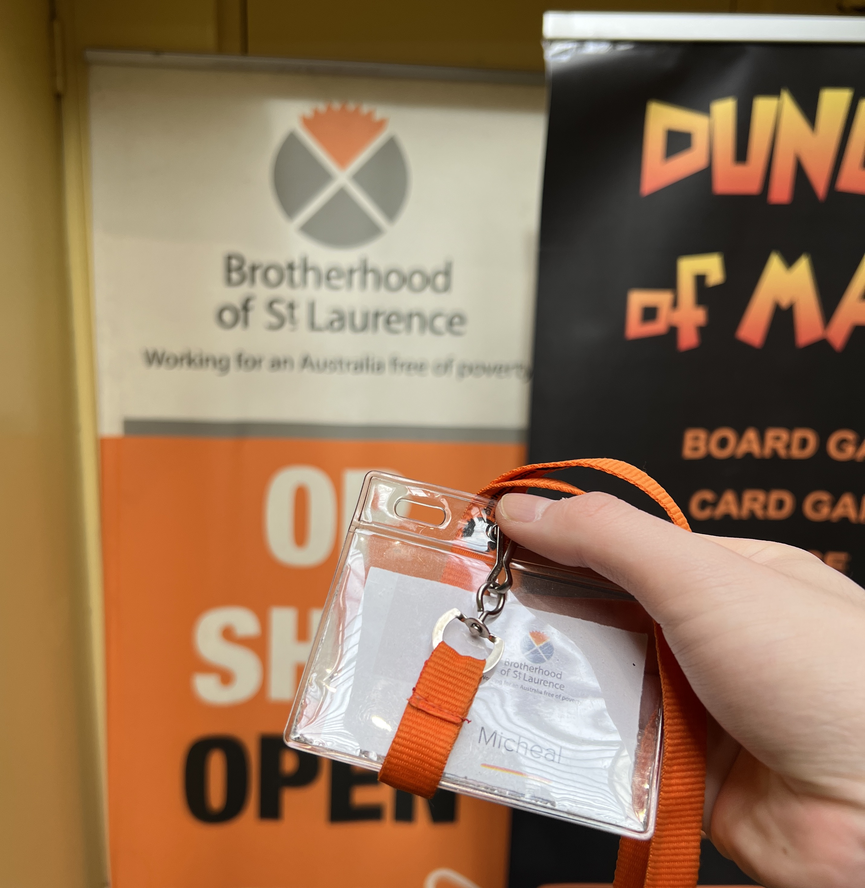
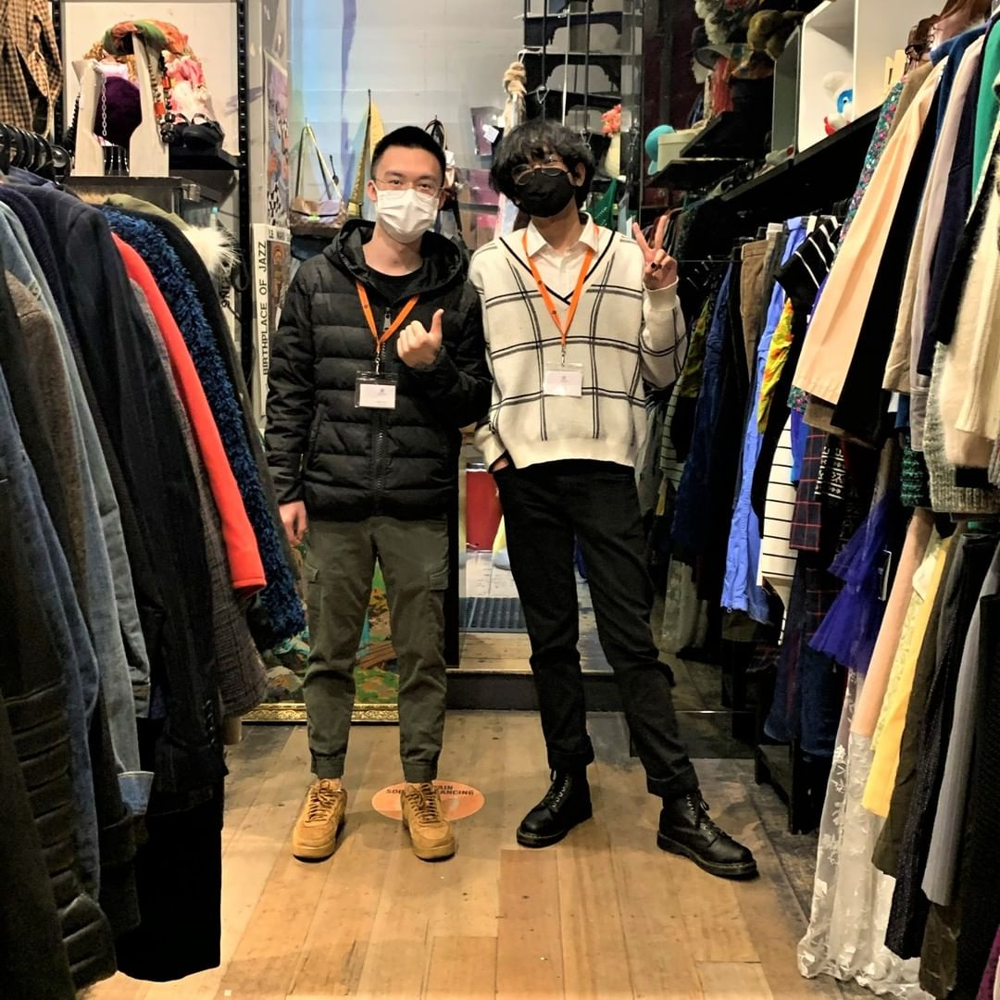
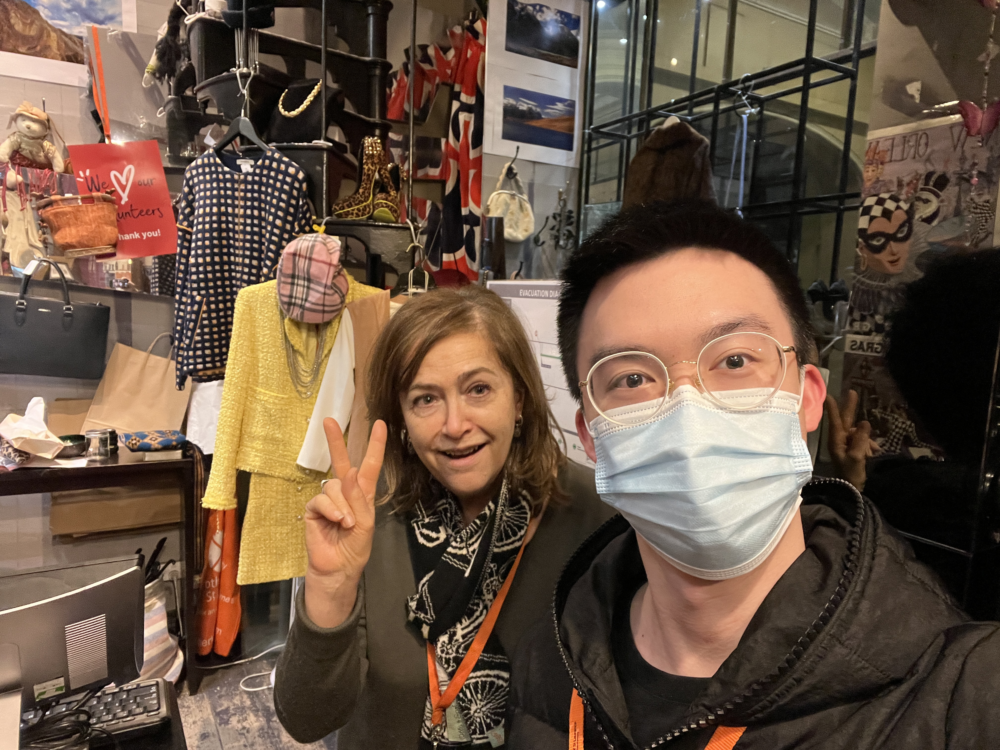

+++
author = "Yu-Wen Michael Zhang"
title = "Melbourne Life"
date = "2022-07-31"
description = "Some Moments in Melbourne"
categories = [
]
tags = [
    "english",
    "text",
    "melboourne",
]
image = "IMG_0641.jpg"
+++

## Being a volunteer at Brotherhood of St. Laurence March 2021 - July 2022
I have been volunteered at Brotherhood of St. Laurence for one and a half year since the beginning of 2021. At first, I just want to complete the [Leaders in Communities Award](https://students.unimelb.edu.au/careers/get-career-ready/leadership-and-employability-programs/leaders-in-communities-award-lica). After completing 40 hours of volunteerring in 4 months, I find that being a volunteer is pretty fun. I can meet lots of different people with different cultural background and experience things that I never experienced before. Thus, I stay there till July 2022.

    <figure>
        
        <figcaption>Picture of the store. Location: Royal Arcade Ground Level, 335 Bourke St, Melbourne VIC 3000
</figcaption>
    </figure>

Here is some photos that I want to share:

### My tag

    <figure>
        
        <figcaption>Picture taken with Nicolai on May 23, 2021</figcaption>
    </figure>

### Picture taken with Nicolai

    <figure>
        
        <figcaption>Picture taken with Nicolai on May 23, 2021</figcaption>
    </figure>

This picture is one of the posts from [**huntergatherer_stores**](https://www.instagram.com/huntergatherer_stores/?hl=en)

### Picture taken with Trent

    <figure>
        
        <figcaption>Last day in the store. Picture taken with Trent on July 25, 2022.</figcaption>
    </figure>

### Picture taken with Niva

    <figure>
        
        <figcaption>Last day in the store. Picture taken with Niva on July 25, 2022.</figcaption>
    </figure>

<!--  -->